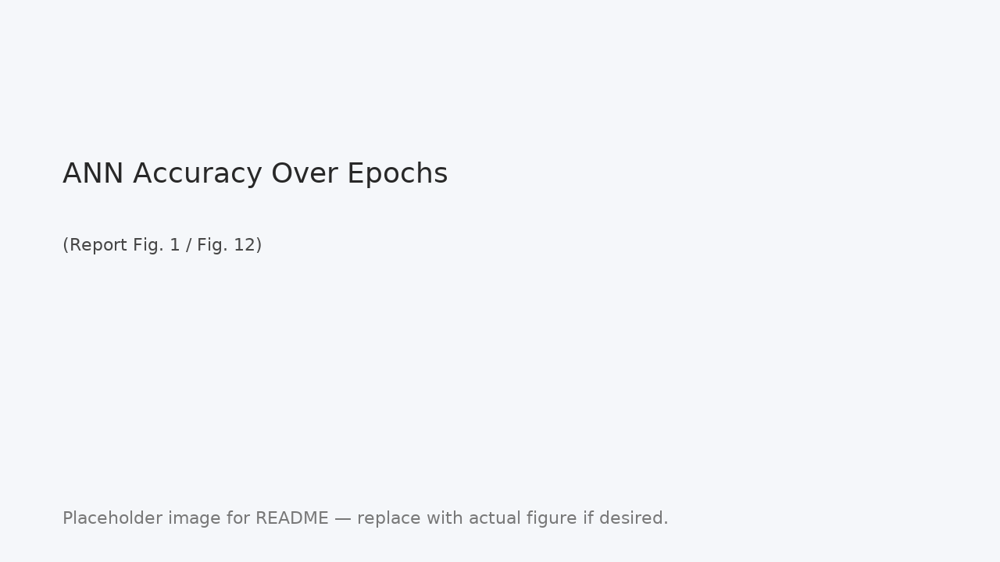
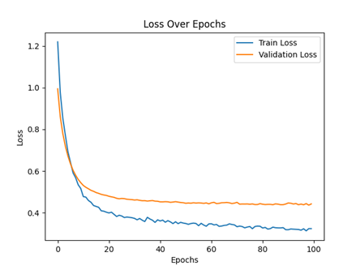
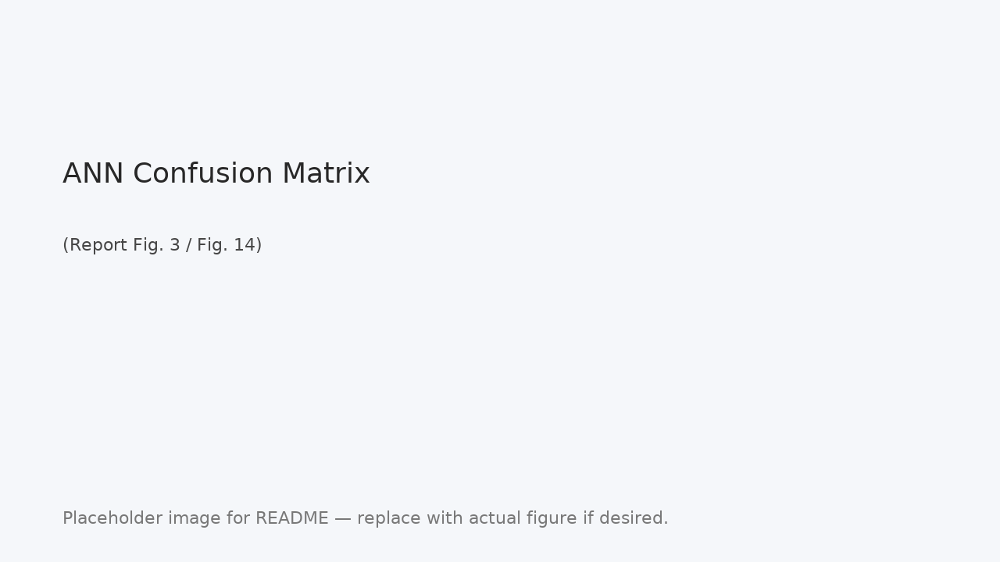
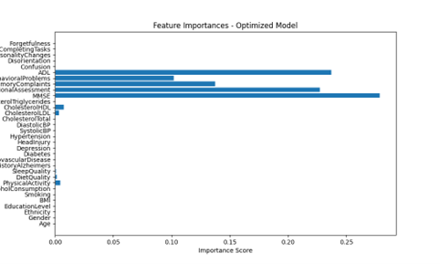
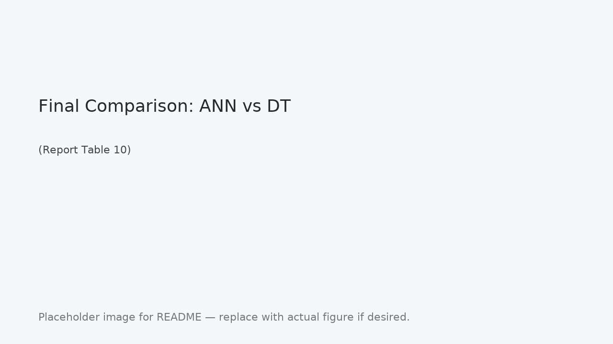

# Alzheimer Detection – ANN & Decision Trees

This repository contains code and artifacts for predicting **Alzheimer's disease** using two approaches:
**Artificial Neural Networks (ANN)** and **Decision Trees (DT)**. It also includes a summary of results,
key figures, and the full project report (PDF).

- **Dataset:** *Alzheimer’s Disease Dataset* – Kaggle: https://www.kaggle.com/datasets/rabieelkharoua/alzheimers-disease-dataset

---

## 📂 Repository Structure
```
.
├─ ANN/                         # ANN code and trained models
│  ├─ ANN_Default.py
│  ├─ ANN_Optimized.py
│  ├─ default_model.h5
│  └─ final_model.h5
├─ Decision_Trees/              # DT and RF code and models
│  ├─ Decision_Tree_Default.py
│  ├─ Decision_Tree_Pruned.py
│  ├─ RandomForest.py
│  ├─ default_decision_tree_model.pkl
│  └─ optimized_decision_tree_model.pkl
├─ images/                      # Figures from report
│  ├─ accuracy_over_epochs.png
│  ├─ loss_over_epochs.png
│  ├─ confusion_matrix_ann.png
│  ├─ dt_feature_importances.png
│  └─ model_comparison.png
├─ alzheimers_disease_data.csv
└─ Ariel_Herrera_AI_Report.pdf
```

---

## 🚀 Quick Start
1. (Optional) Create and activate a virtual environment.
2. Install dependencies: `tensorflow`, `scikit-learn`, `pandas`, `matplotlib`, `joblib`.
3. Place `alzheimers_disease_data.csv` in the repo root (already included here).
4. Run models:
   - ANN: `python ANN/ANN_Default.py` or `python ANN/ANN_Optimized.py`
   - Decision Tree (default/pruned): `python Decision_Trees/Decision_Tree_Default.py` or `Decision_Trees/Decision_Tree_Pruned.py`
   - Random Forest: `python Decision_Trees/RandomForest.py`

---

## 📊 Results Overview

### Artificial Neural Network (ANN)
- **Baseline model** achieved moderate accuracy.
- **Optimized model** (LR=0.001, L2=0.01, Dropout=0.4, simplified topology) improved validation accuracy to **~0.83**.

**Accuracy over training epochs:**  


**Loss over training epochs:**  


**Confusion matrix (ANN final model):**  


---

### Decision Trees & Random Forest
- **Default Decision Tree** provided baseline interpretability.
- **Pruned Decision Tree** achieved **~0.944 accuracy** on test data, highlighting key features such as FunctionalAssessment, MMSE, and ADL.
- **Random Forest** performed competitively but with slightly lower recall.

**Feature importances (Decision Tree):**  


---

### Model Comparison
Overall, the **Pruned Decision Tree** outperformed ANN in this dataset, combining interpretability with high accuracy.

**Final comparison (ANN vs DT):**  


---

## 📝 Notes
- ANN is promising for larger and more complex datasets but required careful regularization and tuning here.
- DT and RF provide strong interpretability advantages.
- See **Ariel_Herrera_AI_Report.pdf** for full methodology, hyperparameter details, and extended results.
